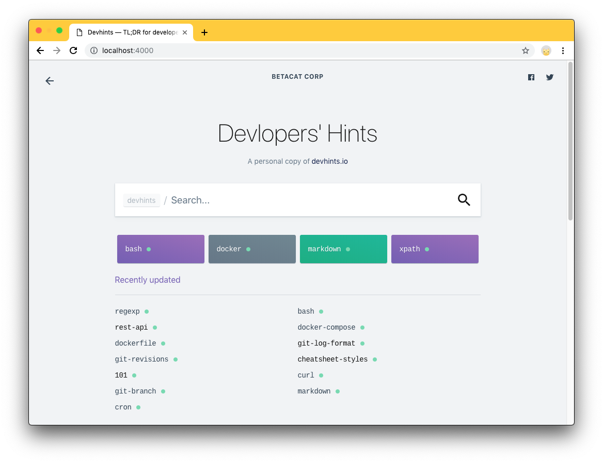

# Your DevHints

Customize and build your cheatsheets, fork from [devhints.io](https://devhints.io).



## Get started

Docker and git should be installed.

```bash
git clone https://github.com/tobyqin/cheatsheets.git
cd cheatsheets
docker run --rm -it -v `pwd`:/srv/jekyll -p 4000:4000 tobyqin/devhints jekyll serve
```
Now go to <http://127.0.0.1:4000>, everything is ready. Try to create/edit/remove any cheatsheets (*.md) in root folder, the site will be auto built, refresh the page you will see the changes.

The cheatsheets guide: <https://devhints.io/cheatsheet-styles>

### Without docker

You should follow [jekyll installation guide](https://jekyllrb.com/docs/installation/), once jekyll and bundle installed, try:

```bash
# clone and cd to cheatsheets
bundle install
bundle exec jekyll server
```

## Configuration

> **/_config.yml** : The major config file for the site. 
> **/_data/content.yml**: The secondary config file for the site. 
> **/_data/\*.yml**: Not so important configurations. 
> **/un-sure/\*.md**: The original cheatsheets from devhints.io, put files here to exclude publishing.

## Deployment 

Option 1, Serve with docker, see "Get started".

Option 2, Trigger build every time your cheatsheets changed, then serve `_output` via IIS or nginx.

# License & Credit

MIT, great thanks to [rstacruz/cheatsheets](https://github.com/rstacruz/cheatsheets).
